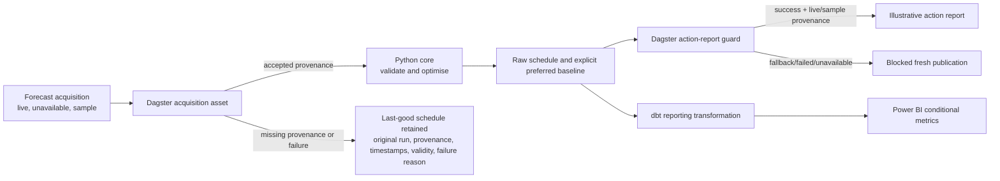

# Reporting lineage

Dagster coordinates acquisition, core optimisation, reporting and last-good
behaviour. The optimiser and business rules remain in the tested Python core.
dbt owns reporting aggregation and reported differences. No Airflow is used,
and dbt is not invoked by Dagster because that would duplicate the existing
verified reporting build rather than improve lineage.

At the fixed reporting grain, dbt rejects mixed schedule-run, provenance, or
source-validity lineage rather than concatenating it into one field. A missing
or clamped preferred start is `not_reportable`, with all reported differences
`NULL`.
